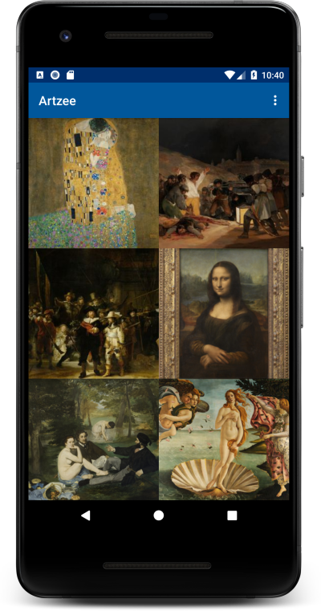
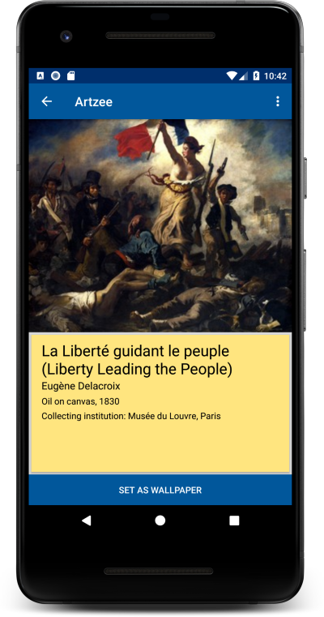
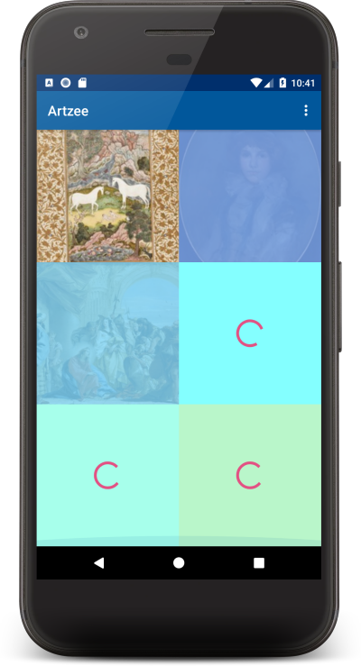
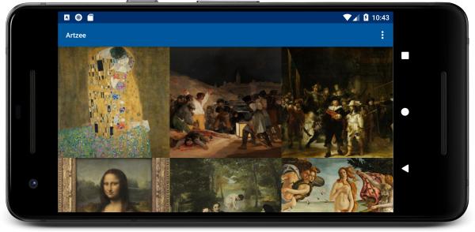
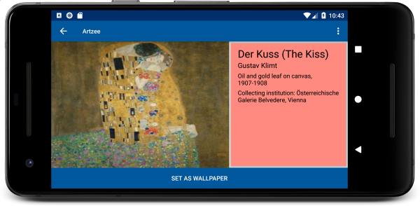

An Android app written in Kotlin to browse the Artsy public API, and set phone wallpaper.<!-- end -->

This was a project to experiment with the Android Architecture Components. It uses Room and the Paging Library for continuous scrolling and caching of network data, and LiveData for UI updates, as well as Retrofit for networking and a light touch of RxJava/RxKotlin. The art is provided by [Artsy](https://www.artsy.net/).

&nbsp;

The app uses prefetching to provide smooth scrolling, with placeholders and loading indicators to provide a pleasing visual experience for when the user is scrolling faster than the data can loaded.

Animations and responsive layouts round out the user experience. You can see screen captures of the animations on the [Github page](https://www.github.com/ajsf/Artzee).

&nbsp;
