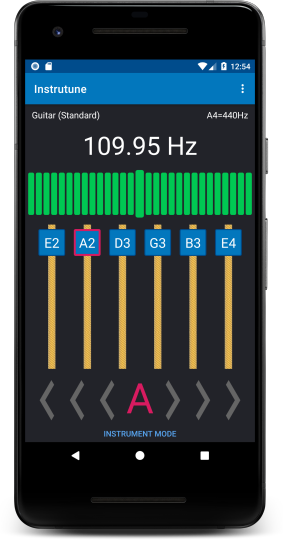
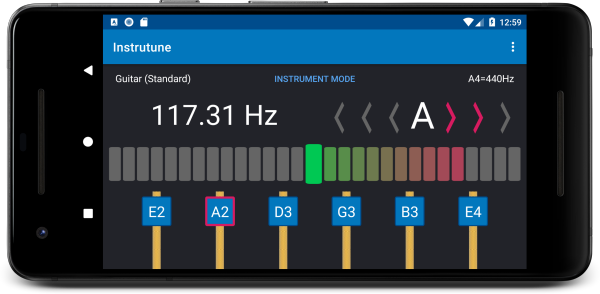
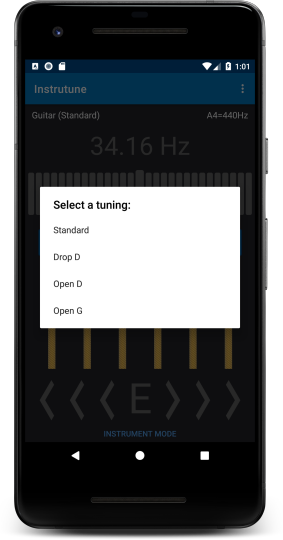
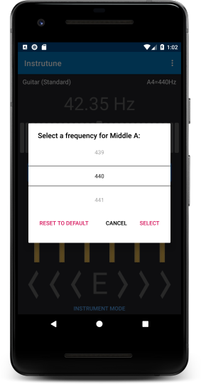

An Android app for tuning instruments, written in Kotlin.<!-- end --> It has a chromatic tuner that can be used for tuning any instrument, but the app is specialized for tuning stringed instrumens. It has multiple tunings for bass, guitar, ukulele and tres, as well as cello, violin, and viola.

This app uses the Model-View-ViewModel UI architecture pattern. RxJava is used for the audio input to frequency detection processing chain, and LiveData is used for UI updates. [TarsosDSP](https://github.com/JorenSix/TarsosDSP) is used for the frequency detection.

[Download the beta version on Google Play.](https://play.google.com/store/apps/details?id=tech.ajsf.instrutune)

&nbsp;&nbsp;&nbsp;&nbsp;

&nbsp;&nbsp;&nbsp;&nbsp;

The app also has a feature that allows you to create custom tunings.

&nbsp;&nbsp;&nbsp;&nbsp;