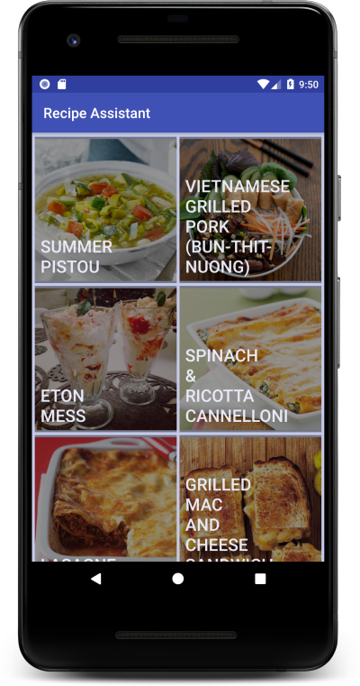
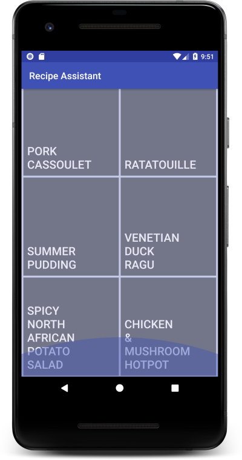
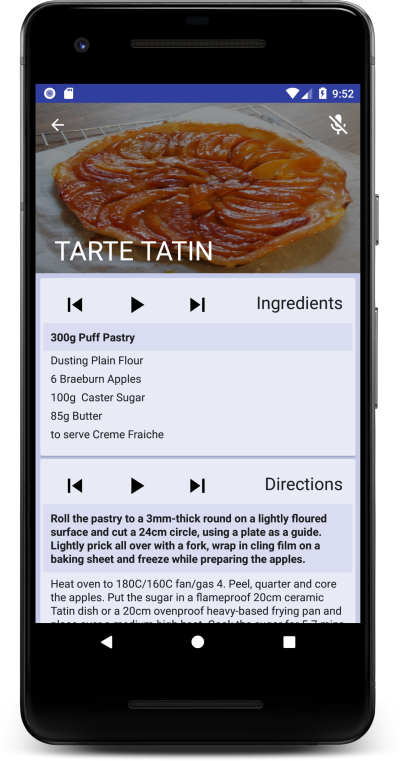
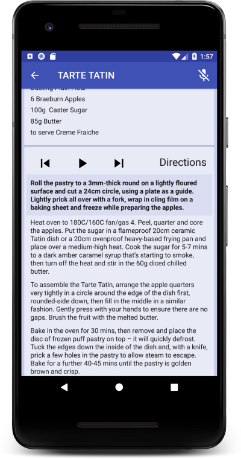
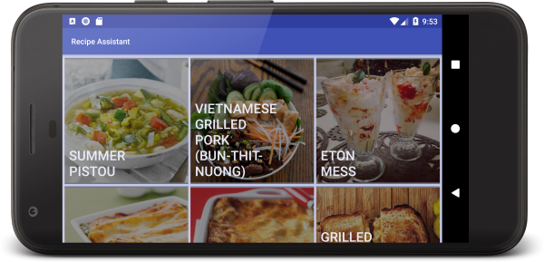
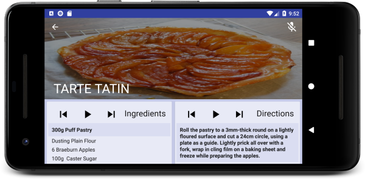
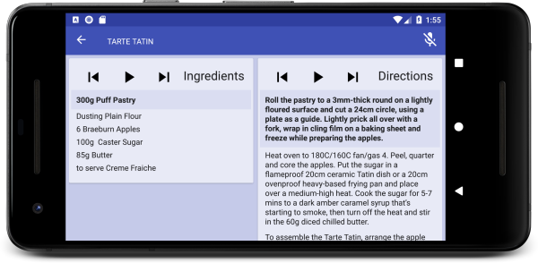

An Android app that pulls recipes from TheMealDb, and can read the recipes out loud, triggered by buttons or voice commands.<!-- end -->

With data provided by the [TheMealDb](https://www.themealdb.com/), this app uses Room and the Paging Library to offer continous scrolling while browsing recipes. It fetches the recipe thumbnails asynchronously, and display the recipe title, allowing smooth continuous user interaction.

&nbsp;

Once a recipe has been selected, voice recognition can be activated, which is implemented using [PocketSphinx](https://github.com/cmusphinx/pocketsphinx). Using either voice activation, or buttons, the user can have the recipe read out loud, which is implemented using [Android TextToSpeech](https://developer.android.com/reference/android/speech/tts/TextToSpeech).

&nbsp;

The app has responsive layouts for both browsing and reading recipes.

&nbsp;

